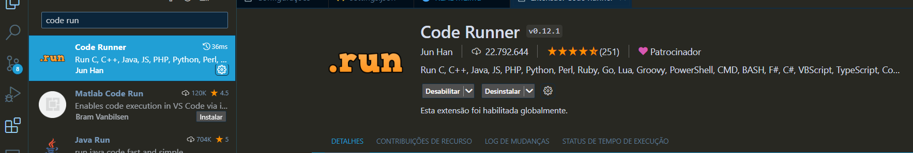
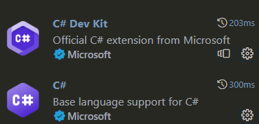
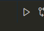

# Projeto de Estudos c#

## Visão Geral  
A opção de utilizar o vs code é para que as práticas de script seja mais flexiveis sem a utilização da criação de projetos .então a escolha foi para a utilização de arquivos simples cs para executar usando o code runner

## Tecnologias Utilizadas

- **c#:** 
- **.Net:** 

## Configuração

Para executar este projeto em sua máquina local, siga estas etapas:

1. Baixe o .Net sdk e o .Net runtime e após isso adicione a variável de ambiente no path referente ao caminho instalado o sdk
   LInk para baixar ambos https://dotnet.microsoft.com/pt-br/download/dotnet-framework/net472
   
2. Configure a váriavel de ambiente onde foi instalado 
3. Copie o caminho e adicione no path da variável de ambiente
4. Abra prompt de comando e cole dotnet --version para verificar se foi instalado
5. Baixe as extensões c# e c# DEv Kit  

6. Baixa a extensáo do code runner

7. Para executar os arquivos cs precisa usar o code run caso a ide seja o vs code e adicionar  "code-runner.executorMap": {
    "csharp": "cd $dir && csc $fileName && $dir$fileNameWithoutExt"
}
 no settings.json 
8. Passos para fazer com que o code runner execute os arquivos .cs

9. Feito isso é só executar o cde runner que vai está ao lado superior direito clicar e executar o code run
 
